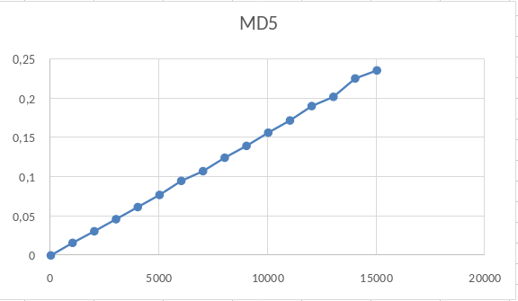
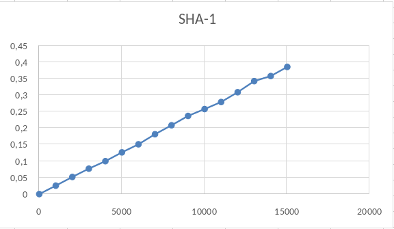
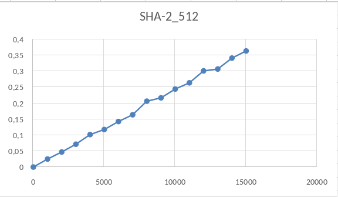
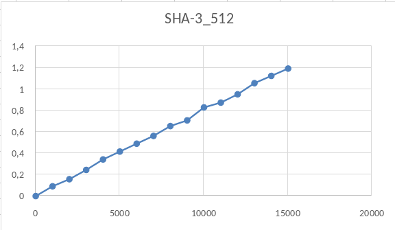
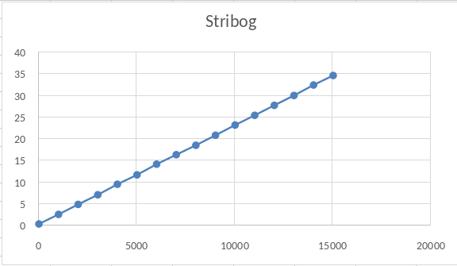
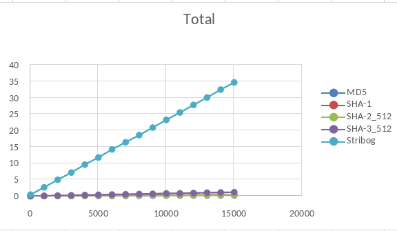

# Замеры JMH / JMH measurements

Реализованы замеры производительности алгоритмов хэширования [ГОСТ 34.11-2018 (Стрибог)](http://protect.gost.ru/v.aspx?control=7&id=232143),
MD5, SHA-1, SHA-512, SHA-3.

Часть курсового проекта [ГОСТ 34.10-2018](https://github.com/nadezhdagub/GOST-34.10-2018)

Implemented and measured the performance of the hashing algorithms of [GOST 34.11-2018 (Stribog)](http://protect.gost.ru/v.aspx?control=7&id=232143),
MD5, SHA-1, SHA-512, SHA-3.

Part of the course project [GOST 34.10-2018](https://github.com/nadezhdagub/GOST-34.10-2018)

| Benchmark                          | Mode | Threads | Samples | Score    | Score Error (99,9%) | Unit  | Param: msgSize |
|------------------------------------|------|---------|---------|----------|---------------------|-------|----------------|
| jmh.MyBenchmark.BenchTest.MD5Bench | avgt | 1       | 10      | 0,000575 | 0,000134            | ms/op | 0              |
| jmh.MyBenchmark.BenchTest.MD5Bench | avgt | 1       | 10      | 0,016579 | 0,000109            | ms/op | 1000           |
| jmh.MyBenchmark.BenchTest.MD5Bench | avgt | 1       | 10      | 0,031401 | 0,000779            | ms/op | 2000           |
| jmh.MyBenchmark.BenchTest.MD5Bench | avgt | 1       | 10      | 0,046777 | 0,001375            | ms/op | 3000           |
| jmh.MyBenchmark.BenchTest.MD5Bench | avgt | 1       | 10      | 0,062277 | 0,000912            | ms/op | 4000           |
| jmh.MyBenchmark.BenchTest.MD5Bench | avgt | 1       | 10      | 0,077721 | 0,005431            | ms/op | 5000           |
| jmh.MyBenchmark.BenchTest.MD5Bench | avgt | 1       | 10      | 0,095682 | 0,003105            | ms/op | 6000           |
| jmh.MyBenchmark.BenchTest.MD5Bench | avgt | 1       | 10      | 0,108056 | 0,00571             | ms/op | 7000           |
| jmh.MyBenchmark.BenchTest.MD5Bench | avgt | 1       | 10      | 0,125252 | 0,004103            | ms/op | 8000           |
| jmh.MyBenchmark.BenchTest.MD5Bench | avgt | 1       | 10      | 0,140318 | 0,004212            | ms/op | 9000           |
| jmh.MyBenchmark.BenchTest.MD5Bench | avgt | 1       | 10      | 0,157178 | 0,007116            | ms/op | 10000          |
| jmh.MyBenchmark.BenchTest.MD5Bench | avgt | 1       | 10      | 0,17275  | 0,004997            | ms/op | 11000          |
| jmh.MyBenchmark.BenchTest.MD5Bench | avgt | 1       | 10      | 0,191099 | 0,010348            | ms/op | 12000          |
| jmh.MyBenchmark.BenchTest.MD5Bench | avgt | 1       | 10      | 0,202906 | 0,008658            | ms/op | 13000          |
| jmh.MyBenchmark.BenchTest.MD5Bench | avgt | 1       | 10      | 0,226344 | 0,038216            | ms/op | 14000          |
| jmh.MyBenchmark.BenchTest.MD5Bench | avgt | 1       | 10      | 0,236611 | 0,010798            | ms/op | 15000          |

| Benchmark                           | Mode | Threads | Samples | Score    | Score Error (99,9%) | Unit  | Param: msgSize |
|-------------------------------------|------|---------|---------|----------|---------------------|-------|----------------|
| jmh.MyBenchmark.BenchTest.SHA1Bench | avgt | 1       | 10      | 0,000855 | 0,000167            | ms/op | 0              |
| jmh.MyBenchmark.BenchTest.SHA1Bench | avgt | 1       | 10      | 0,026401 | 0,000983            | ms/op | 1000           |
| jmh.MyBenchmark.BenchTest.SHA1Bench | avgt | 1       | 10      | 0,052801 | 0,001958            | ms/op | 2000           |
| jmh.MyBenchmark.BenchTest.SHA1Bench | avgt | 1       | 10      | 0,077963 | 0,005155            | ms/op | 3000           |
| jmh.MyBenchmark.BenchTest.SHA1Bench | avgt | 1       | 10      | 0,100707 | 0,000458            | ms/op | 4000           |
| jmh.MyBenchmark.BenchTest.SHA1Bench | avgt | 1       | 10      | 0,127419 | 0,00645             | ms/op | 5000           |
| jmh.MyBenchmark.BenchTest.SHA1Bench | avgt | 1       | 10      | 0,151881 | 0,004452            | ms/op | 6000           |
| jmh.MyBenchmark.BenchTest.SHA1Bench | avgt | 1       | 10      | 0,182413 | 0,019381            | ms/op | 7000           |
| jmh.MyBenchmark.BenchTest.SHA1Bench | avgt | 1       | 10      | 0,20959  | 0,005357            | ms/op | 8000           |
| jmh.MyBenchmark.BenchTest.SHA1Bench | avgt | 1       | 10      | 0,237936 | 0,015531            | ms/op | 9000           |
| jmh.MyBenchmark.BenchTest.SHA1Bench | avgt | 1       | 10      | 0,258726 | 0,015965            | ms/op | 10000          |
| jmh.MyBenchmark.BenchTest.SHA1Bench | avgt | 1       | 10      | 0,280134 | 0,01104             | ms/op | 11000          |
| jmh.MyBenchmark.BenchTest.SHA1Bench | avgt | 1       | 10      | 0,309845 | 0,009346            | ms/op | 12000          |
| jmh.MyBenchmark.BenchTest.SHA1Bench | avgt | 1       | 10      | 0,343451 | 0,015158            | ms/op | 13000          |
| jmh.MyBenchmark.BenchTest.SHA1Bench | avgt | 1       | 10      | 0,358867 | 0,012145            | ms/op | 14000          |
| jmh.MyBenchmark.BenchTest.SHA1Bench | avgt | 1       | 10      | 0,386539 | 0,009032            | ms/op | 15000          |

| Benchmark                             | Mode | Threads | Samples | Score    | Score Error (99,9%) | Unit  | Param: msgSize |
|---------------------------------------|------|---------|---------|----------|---------------------|-------|----------------|
| jmh.MyBenchmark.BenchTest.SHA512Bench | avgt | 1       | 10      | 0,001562 | 0,000409            | ms/op | 0              |
| jmh.MyBenchmark.BenchTest.SHA512Bench | avgt | 1       | 10      | 0,026566 | 0,004714            | ms/op | 1000           |
| jmh.MyBenchmark.BenchTest.SHA512Bench | avgt | 1       | 10      | 0,048598 | 0,001469            | ms/op | 2000           |
| jmh.MyBenchmark.BenchTest.SHA512Bench | avgt | 1       | 10      | 0,072975 | 0,002254            | ms/op | 3000           |
| jmh.MyBenchmark.BenchTest.SHA512Bench | avgt | 1       | 10      | 0,10307  | 0,00233             | ms/op | 4000           |
| jmh.MyBenchmark.BenchTest.SHA512Bench | avgt | 1       | 10      | 0,11887  | 0,003328            | ms/op | 5000           |
| jmh.MyBenchmark.BenchTest.SHA512Bench | avgt | 1       | 10      | 0,143869 | 0,007201            | ms/op | 6000           |
| jmh.MyBenchmark.BenchTest.SHA512Bench | avgt | 1       | 10      | 0,165073 | 0,003464            | ms/op | 7000           |
| jmh.MyBenchmark.BenchTest.SHA512Bench | avgt | 1       | 10      | 0,207493 | 0,007961            | ms/op | 8000           |
| jmh.MyBenchmark.BenchTest.SHA512Bench | avgt | 1       | 10      | 0,217903 | 0,012785            | ms/op | 9000           |
| jmh.MyBenchmark.BenchTest.SHA512Bench | avgt | 1       | 10      | 0,245387 | 0,01094             | ms/op | 10000          |
| jmh.MyBenchmark.BenchTest.SHA512Bench | avgt | 1       | 10      | 0,264909 | 0,013819            | ms/op | 11000          |
| jmh.MyBenchmark.BenchTest.SHA512Bench | avgt | 1       | 10      | 0,30226  | 0,021343            | ms/op | 12000          |
| jmh.MyBenchmark.BenchTest.SHA512Bench | avgt | 1       | 10      | 0,308017 | 0,013267            | ms/op | 13000          |
| jmh.MyBenchmark.BenchTest.SHA512Bench | avgt | 1       | 10      | 0,342207 | 0,020027            | ms/op | 14000          |
| jmh.MyBenchmark.BenchTest.SHA512Bench | avgt | 1       | 10      | 0,364467 | 0,019193            | ms/op | 15000          |

| Benchmark                           | Mode | Threads | Samples | Score    | Score Error (99,9%) | Unit  | Param: msgSize |
|-------------------------------------|------|---------|---------|----------|---------------------|-------|----------------|
| jmh.MyBenchmark.BenchTest.SHA3Bench | avgt | 1       | 10      | 0,002005 | 0,000219            | ms/op | 0              |
| jmh.MyBenchmark.BenchTest.SHA3Bench | avgt | 1       | 10      | 0,093351 | 0,004665            | ms/op | 1000           |
| jmh.MyBenchmark.BenchTest.SHA3Bench | avgt | 1       | 10      | 0,159791 | 0,008085            | ms/op | 2000           |
| jmh.MyBenchmark.BenchTest.SHA3Bench | avgt | 1       | 10      | 0,246669 | 0,017736            | ms/op | 3000           |
| jmh.MyBenchmark.BenchTest.SHA3Bench | avgt | 1       | 10      | 0,344416 | 0,075711            | ms/op | 4000           |
| jmh.MyBenchmark.BenchTest.SHA3Bench | avgt | 1       | 10      | 0,418477 | 0,015575            | ms/op | 5000           |
| jmh.MyBenchmark.BenchTest.SHA3Bench | avgt | 1       | 10      | 0,492    | 0,015565            | ms/op | 6000           |
| jmh.MyBenchmark.BenchTest.SHA3Bench | avgt | 1       | 10      | 0,564634 | 0,020696            | ms/op | 7000           |
| jmh.MyBenchmark.BenchTest.SHA3Bench | avgt | 1       | 10      | 0,656635 | 0,021384            | ms/op | 8000           |
| jmh.MyBenchmark.BenchTest.SHA3Bench | avgt | 1       | 10      | 0,709791 | 0,01449             | ms/op | 9000           |
| jmh.MyBenchmark.BenchTest.SHA3Bench | avgt | 1       | 10      | 0,831121 | 0,012983            | ms/op | 10000          |
| jmh.MyBenchmark.BenchTest.SHA3Bench | avgt | 1       | 10      | 0,876    | 0,011706            | ms/op | 11000          |
| jmh.MyBenchmark.BenchTest.SHA3Bench | avgt | 1       | 10      | 0,953723 | 0,017212            | ms/op | 12000          |
| jmh.MyBenchmark.BenchTest.SHA3Bench | avgt | 1       | 10      | 1,057967 | 0,025069            | ms/op | 13000          |
| jmh.MyBenchmark.BenchTest.SHA3Bench | avgt | 1       | 10      | 1,125865 | 0,028012            | ms/op | 14000          |
| jmh.MyBenchmark.BenchTest.SHA3Bench | avgt | 1       | 10      | 1,194427 | 0,039668            | ms/op | 15000          |

| Benchmark                              | Mode | Threads | Samples | Score     | Score Error (99,9%) | Unit  | Param: msgSize |
|----------------------------------------|------|---------|---------|-----------|---------------------|-------|----------------|
| jmh.MyBenchmark.BenchTest.StribogBench | avgt | 1       | 10      | 0,469574  | 0,033219            | ms/op | 0              |
| jmh.MyBenchmark.BenchTest.StribogBench | avgt | 1       | 10      | 2,682972  | 0,189678            | ms/op | 1000           |
| jmh.MyBenchmark.BenchTest.StribogBench | avgt | 1       | 10      | 4,991103  | 0,385829            | ms/op | 2000           |
| jmh.MyBenchmark.BenchTest.StribogBench | avgt | 1       | 10      | 7,211056  | 0,478637            | ms/op | 3000           |
| jmh.MyBenchmark.BenchTest.StribogBench | avgt | 1       | 10      | 9,641405  | 0,655528            | ms/op | 4000           |
| jmh.MyBenchmark.BenchTest.StribogBench | avgt | 1       | 10      | 11,816456 | 0,786621            | ms/op | 5000           |
| jmh.MyBenchmark.BenchTest.StribogBench | avgt | 1       | 10      | 14,280464 | 1,180045            | ms/op | 6000           |
| jmh.MyBenchmark.BenchTest.StribogBench | avgt | 1       | 10      | 16,467694 | 1,608232            | ms/op | 7000           |
| jmh.MyBenchmark.BenchTest.StribogBench | avgt | 1       | 10      | 18,649201 | 1,188954            | ms/op | 8000           |
| jmh.MyBenchmark.BenchTest.StribogBench | avgt | 1       | 10      | 20,962957 | 1,298979            | ms/op | 9000           |
| jmh.MyBenchmark.BenchTest.StribogBench | avgt | 1       | 10      | 23,323958 | 1,236215            | ms/op | 10000          |
| jmh.MyBenchmark.BenchTest.StribogBench | avgt | 1       | 10      | 25,573662 | 1,632472            | ms/op | 11000          |
| jmh.MyBenchmark.BenchTest.StribogBench | avgt | 1       | 10      | 27,879668 | 1,310401            | ms/op | 12000          |
| jmh.MyBenchmark.BenchTest.StribogBench | avgt | 1       | 10      | 30,151233 | 1,776927            | ms/op | 13000          |
| jmh.MyBenchmark.BenchTest.StribogBench | avgt | 1       | 10      | 32,574246 | 2,043395            | ms/op | 14000          |
| jmh.MyBenchmark.BenchTest.StribogBench | avgt | 1       | 10      | 34,772733 | 2,412166            | ms/op | 15000          |

В конечном итоге, данная реализация Стрибог значительно проигрывает по производительности другим алгоритмам.

In the end, this implementation of Stribog significantly loses performance to other algorithms.

